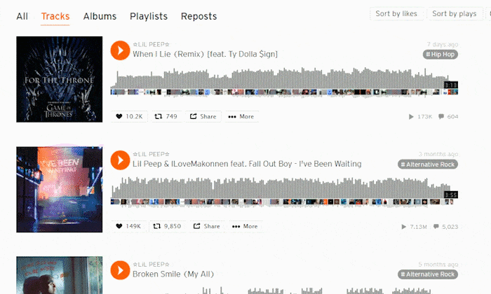

# soundcloud-sort

Tampermonkey userscript adding sort functionality to SoundCloud

## Installation

1. Get [Tampermonkey](https://www.tampermonkey.net/)
2. Open [`soundcloud-sort.user.js`](https://github.com/akelsch/soundcloud-sort/raw/master/soundcloud-sort.user.js)
3. Click Install

The script runs on tracks subpages only, e.g. `https://soundcloud.com/lil_peep/tracks`.
Reload the page if the buttons don't appear when browsing SoundCloud.

## Todo

- [ ] Reorder play queue
